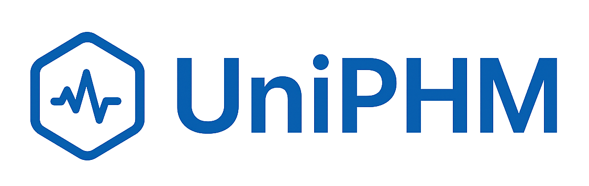
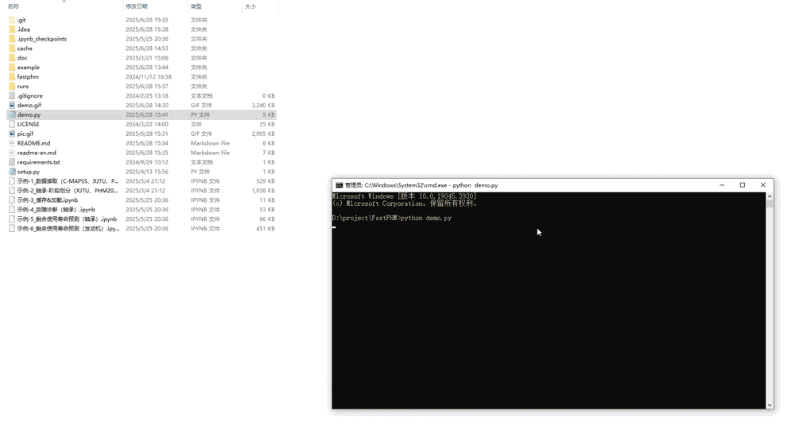

<div align="center">
  
</div>

<div align="center">
<h3>🔍 A Unified Framework for Prognostics and Health Management Tasks</h3>
</div>

<div align="center">

[](https://www.gnu.org/licenses/gpl-3.0)
[](https://gitee.com/holdenmcgorin/UniPHM/stargazers)
[](https://github.com/holden-mcgorin/UniPHM/stargazers)
</div>

<div align="center">

[简体中文](README.md) | [English](readme-en.md)

</div>

<div align="center">
    <a href="https://gitee.com/holdenmcgorin/FastPHM" target="_blank">Gitee</a> •
    <a href="https://github.com/holden-mcgorin/FastPHM" target="_blank">GitHub</a>
</div>

###  
> 1. **UniPHM** (Unified PHM Framework) is designed for the field of Prognostics and Health Management (PHM) and supports various PHM tasks based on deep learning methods, such as **Remaining Useful Life (RUL) prediction, fault diagnosis, and anomaly detection**.
> 2. The framework aims to provide a **unified, general, and modular** research and experimentation platform that standardizes data processing, model training, and performance evaluation. It simplifies experiment construction, enhances research and development efficiency, and offers researchers a clear and extensible tool for developing and comparing various PHM tasks.
> 3. The project is continuously evolving, and more reproducible research cases based on this framework will be added over time. You're welcome to ⭐ star the project and join the discussion!


## 🚀     Feature Overview
- ✅ **Compatible with Multiple Deep Learning Frameworks**: Supports model development using PyTorch(primary), TensorFlow, and Pyro

- 📦 **Automatic Dataset Import**: Built-in support for popular datasets such as XJTU-SY, PHM2012, C-MAPSS, and PHM2008

- 📝 **Automatic Logging of Experimental Parameters and Results**: Includes model configs, regularization terms, iteration counts, sampling settings, etc.

- 🔁 **Custom Callback Support for Each Epoch**: Built-in EarlyStopping and TensorBoard are both implemented through callbacks.

- 🛠 **Model Training Monitoring**: Supports TensorBoard visualization and logging/alarming for gradient anomalies (vanishing/exploding gradients).

- 🔍 **Preprocessing & Feature Extraction**: Includes sliding window, normalization, RMS, kurtosis, and other techniques

- 🧠 **Flexible Degradation Stage Segmentation**: Supports 3σ rule, FPT (First Predictable Time), and more

- 🔮 **Versatile Prediction Methods**: Enables end-to-end forecasting, step-by-step rolling prediction, and uncertainty modeling

- 📊 **Rich Result Visualization**: Confusion matrices, degradation curves, prediction plots, attention maps, and more

- 📁 **Support for Multiple File Formats**: Easily import/export models, datasets, results, and caches in CSV, PKL, etc.

- 📈 **Comprehensive Evaluation Metrics**: MAE, MSE, RMSE, MAPE, PHM2012 Score, NASA Score, and more

- 🔧 **Modular and Extensible Design**: Add custom algorithms or components with minimal effort

## 💻    Experiment Example

The following is a **minimal working example** for completing a PHM experiment (RUL prediction), containing only the **basic steps** of data loading, model training, and evaluation — perfect for quick start.

> This example focuses on the minimum runnable workflow. The framework supports much more powerful features, which are demonstrated in the `Notebook Examples` under the project root directory.

Just a few lines of code are enough to complete an end-to-end experiment workflow:

```python
# Step 1: Load raw data
data_loader = XJTULoader('D:\\data\\dataset\\XJTU-SY_Bearing_Datasets')
bearing = data_loader.load_entity('Bearing1_1')

# Step 2: Construct dataset
labeler = BearingRulLabeler(2048)
dataset = labeler.label(bearing, 'Horizontal Vibration')
train_set, test_set = dataset.split_by_ratio(0.7)

# Step 3: Train model
model = CNN(input_size=2048, output_size=1)
trainer = BaseTrainer()
trainer.train(model, train_set)

# Step 4: Test model
tester = BaseTester()
result = tester.test(model, test_set)

# Step 5: Evaluate results
evaluator = Evaluator()
evaluator.add(MAE(), MSE(), RMSE(), PercentError(), PHM2012Score(), PHM2008Score())
evaluator(test_set, result)
```

After integrating the visualization code and additional functional components, the program produced the following output in the CMD environment.  
( This example demonstrates how the program runs in a command-line interface.
For local development, however, it is recommended to use integrated development environments (IDEs) such as PyCharm, VSCode, or Jupyter Notebook for a more efficient and user-friendly experience. )




## 📚 Reproduced Papers
> This framework has been used to reproduce several published methods in the PHM field.  
> The original contributions are treated with full respect. If the reproduced results deviate from the originals, it may be due to differences in implementation or experimental setup, or potentially due to oversights during reproduction. Feedback and suggestions are warmly welcomed via the issue section. 

### ✅ Reproduced Papers Overview
coming soon

## 📂    File Structure
- uniphm – Core framework code.
- doc – Detailed documentation (recommended for writing custom components).
- example – Sample experimental scripts (native Python).

### 📦 Dataset Sources

| Name              | Description                                                                 | Link                                                                 |
|-------------------|-----------------------------------------------------------------------------|----------------------------------------------------------------------|
| XJTU-SY Dataset   | Rolling bearing degradation dataset published by Xi'an Jiaotong University | [Visit](https://biaowang.tech/xjtu-sy-bearing-datasets/)            |
| PHM2012 Dataset   | Bearing fault dataset from the IEEE PHM 2012 data challenge                 | [Visit](https://github.com/Lucky-Loek/ieee-phm-2012-data-challenge-dataset) |
| C-MAPSS Dataset   | Simulated turbofan engine degradation data provided by NASA, widely used for RUL prediction | [Visit](https://data.nasa.gov/Aeorspace/CMAPSS-Jet-Engine-Simulated-Data/ff5v-kuh6) |
| PHM2008 Dataset   | Early turbomachinery data from the PHM08 challenge by NASA                  | [Visit](https://data.nasa.gov/download/nk8v-ckry/application%2Fzip) |
| NASA Data Archive | A collection of multiple health datasets from NASA across various PHM tasks | [Visit](https://www.nasa.gov/intelligent-systems-division/discovery-and-systems-health/pcoe/pcoe-data-set-repository/) |


## ⚠     Important Notes
> - This framework is developed using Python 3.8.10. Compatibility issues may arise with other versions. If you encounter any problems, feel free to raise an issue.
> - When reading datasets, do not change the internal file structure of the original datasets (you may keep only partial data). Altering the file structure may lead to data reading failures.


If you find this project useful, please give it a ⭐!
If you think there’s room for improvement, feel free to submit an issue—your feedback is the greatest motivation for further updates! 😃


##### @KeyGold Studio @AndrewStudio
##### 📧 Email: andrewstudio@foxmail.com
##### 🌐 Website: http://8.138.46.66/#/home

